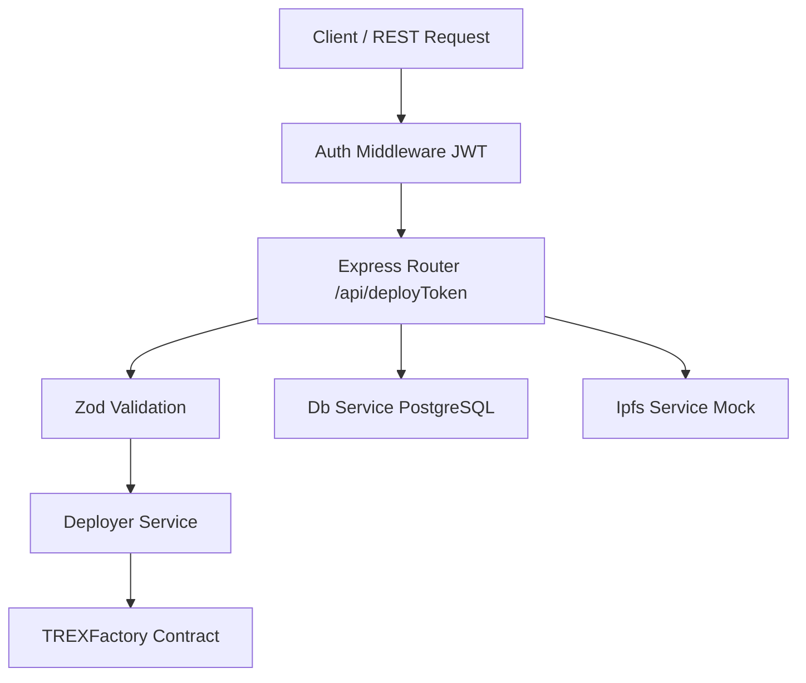
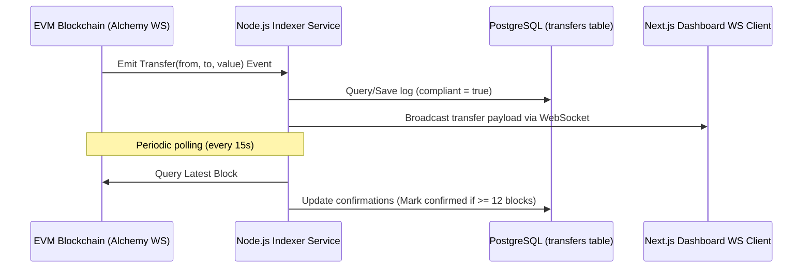

# Tokenization Engine Implementation Walkthrough

We have designed and built a highly robust, clean, and production-ready **TypeScript Tokenization Engine** for deploying and managing compliance-centric ERC-3643 token suites.

---

## 🏗️ Architecture & Component Design

The microservice follows a modular, decoupled architecture:

1. **Authentication Middleware (`src/middlewares/auth.ts`)**: Decodes incoming JWTs, validates the signature using the configured secret key, and restricts requests to users with the `ADMIN` or `ISSUER` role.
2. **Input Validation (`src/routes/token.ts`)**: Applies a Zod schema to ensure that variables like token names, symbols, issuers (valid Ethereum addresses), and claim topics (valid 32-byte hashes) are correctly formatted.
3. **Blockchain Deployer Service (`src/services/deployer.ts`)**: 
   - Dynamically estimates EIP-1559 gas fees (or legacy gas pricing) adding a 20% safety buffer.
   - Manages correct nonce increments (querying `pending` block transaction count).
   - Incorporates retry logic with exponential backoff for transaction resubmissions.
   - Decodes emitted events from the `TREXFactory` receipt to retrieve the deployed token suite addresses (`Token`, `IdentityRegistry`, `ModularCompliance`).
4. **Mock IPFS & Local Persistence (`src/services/ipfs.ts`)**:
   - Saves the resulting deployment metadata artifact locally under the `published/` folder.
   - Mimics IPFS uploads by hashing the metadata content and returning simulated IPFS URL and CIDv0 hashes.
5. **Database Service (`src/services/db.ts`)**: Stores deployment records inside the PostgreSQL `deployments` table.

---

## 🗄️ Database Schema

The microservice automatically initializes the schema if the table does not exist:

| Column | Type | Description |
|---|---|---|
| `id` | `SERIAL` | Primary Key |
| `chain_id` | `INT` | Target Network Chain ID |
| `token_address` | `VARCHAR(42)` | Deployed ERC-3643 Token Proxy Address |
| `identity_registry` | `VARCHAR(42)` | Associated Identity Registry Proxy Address |
| `compliance_address` | `VARCHAR(42)` | Associated Modular Compliance Proxy Address |
| `owner` | `VARCHAR(42)` | Issuer/Admin who triggered the deployment |
| `params` | `JSONB` | Input parameters used during deployment |
| `tx_hash` | `VARCHAR(66)` | Ethereum Transaction Hash |
| `block` | `INT` | Block Number in which the suite was confirmed |
| `created_at` | `TIMESTAMP` | Record creation date |

---

## 🧪 Hardhat Test Suite

Our tests (`test/deploy.test.ts`) perform an end-to-end integration flow on the in-memory Hardhat Network:
- Deploys full ERC-3643 implementation registries and `TREXFactory`.
- Triggers a deployment using the `DeployerService` to verify correct parameters construction.
- Asserts that token minting is restricted to verified identities only.
- Registers Alice and Bob's identities in the `IdentityRegistry`.
- Issues KYC claim topics signed by a trusted issuer, proving transfer validation compliance (refuses transfers prior to claims addition, allows transfers once claims are active).

---

## 📡 Event Indexer Service

In addition to the deployment engine and frontend, we have implemented a standalone **Tokenization Indexer** in the `indexer` folder. It serves as the data linkage between the smart contracts and the user dashboard:

1. **Ethers WS Provider**: Attaches listeners to Alchemy/RPC nodes.
2. **Local ws server**: Broadcasts logs to active browser sessions.
3. **Confirmations Updater**: Calculates finality depths.
4. **Jest Coverage**: Complete mock validation of the pipeline (`npm run test` passes cleanly).
