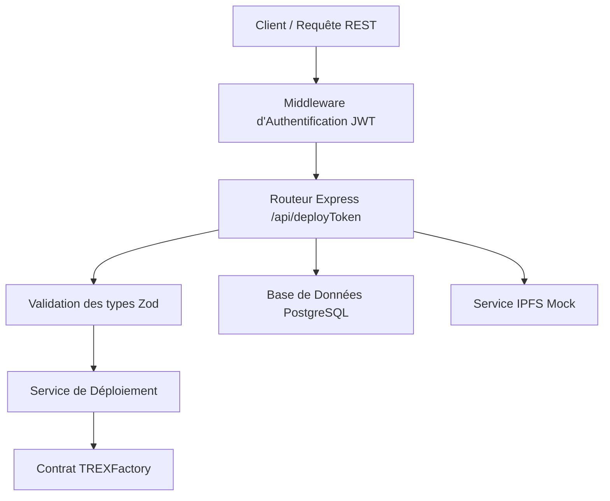
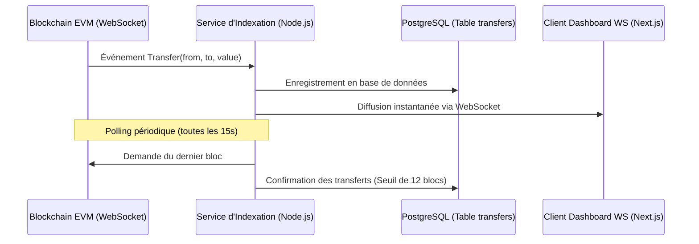

# Guide d'Architecture et de Fonctionnement de la Suite ERC-3643

Ce document détaille la conception, l'architecture et les flux d'exécution de la suite de tokenisation de titres financiers conforme à la norme ERC-3643.

---

## 🏗️ Architecture et Composants Réseau

Le système est structuré de manière modulaire en microservices découplés :

1. **Middleware d'Authentification (`src/middlewares/auth.ts`)** : Vérifie la signature du JWT et contrôle les rôles (`ADMIN` ou `ISSUER`).
2. **Validation Zod (`src/routes/token.ts`)** : Garantie que les paramètres entrés (adresses d'émetteurs de claims, clés de management) respectent le schéma requis.
3. **Service de Déploiement (`src/services/deployer.ts`)** :
    * Estime dynamiquement les frais de gaz EIP-1559 avec un tampon de sécurité de 20%.
    * Suit les nonces de transaction (statut `pending`).
    * Implémente des mécanismes de retry avec backoff exponentiel en cas de congestion réseau.
4. **Service IPFS Mock (`src/services/ipfs.ts`)** : Sauvegarde localement les métadonnées et simule une publication décentralisée en générant des hashs CIDv0 valides.
5. **Persistance PostgreSQL (`src/services/db.ts`)** : Enregistre le suivi des tokens créés.

---

## 📡 Indexeur d'Événements Temps Réel

Le service `indexer` assure le pont entre les contrats intelligents déployés sur la blockchain et le tableau de bord (dashboard) :

---

## 📊 Métriques & Monitoring Prometheus

Pour le monitoring institutionnel, le service expose un serveur Prometheus HTTP (`http://localhost:9090/metrics`) collectant :
*   **Nombre de blocs traités** (`indexer_blocks_indexed_total`)
*   **Nombre de transferts indexés** (`indexer_events_indexed_total`)
*   **Connexions WS actives** (`indexer_websocket_connections_active`)
*   **Délai d'indexation (Lag)** (`indexer_lag_seconds`)
*   **Alertes de retard (>30s)** diffusées via Webhook.
